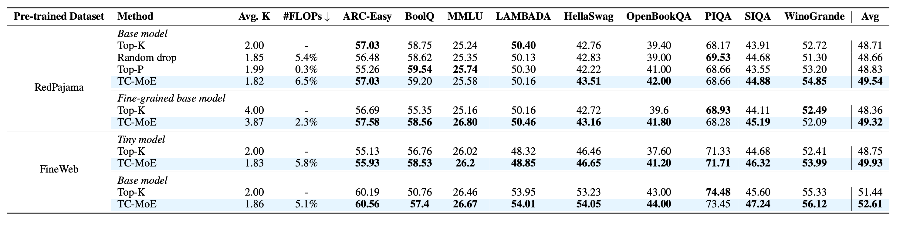

# [ICLR 2025] TC-MoE: Augmenting Mixture of Experts with Ternary Expert Choice

[](https://huggingface.co/stiger1000/TC-MoE)
[](https://opensource.org/licenses/Apache-2.0)

This repository provides the code for the paper 

## Key Features
✅ ​**Ternary Expert Space**  
Expands expert capacity with {-1, 0, 1} multipliers at minimal computational cost


🚀 ​**Efficiency Gains**  
Reduces activated experts by ​**9%** while improving average performance by ​**1.1%**  

⚖️ ​**Dynamic Load Balancing**  
Novel load balance loss ensures equitable expert utilization  

🔧 ​**Flexible Trade-offs**  
Reward loss mechanism for efficiency-effectiveness optimization

## Main Results


## Usage
```python
from transformers import AutoModelForCausalLM, AutoTokenizer
model = AutoModelForCausalLM.from_pretrained("stiger1000/TC-MoE")
tokenizer = AutoTokenizer.from_pretrained("stiger1000/TC-MoE")
inputs = tokenizer("The capital of France is", return_tensors="pt")
outputs = model.generate(**inputs, max_length=50)
print(tokenizer.decode(outputs[0]))
```

## Citation
```bibtex
@inproceedings{yan2025tcmoe,
  title={TC-MoE: Augmenting Mixture of Experts with Ternary Expert Choice},
  author={Yan, Shen and Bin, Xingyan and Zhang, Sijun and Wang, Yisen and Lin, Zhouchen},
  booktitle={The Thirteenth International Conference on Learning Representations},
  year={2025}
}
```